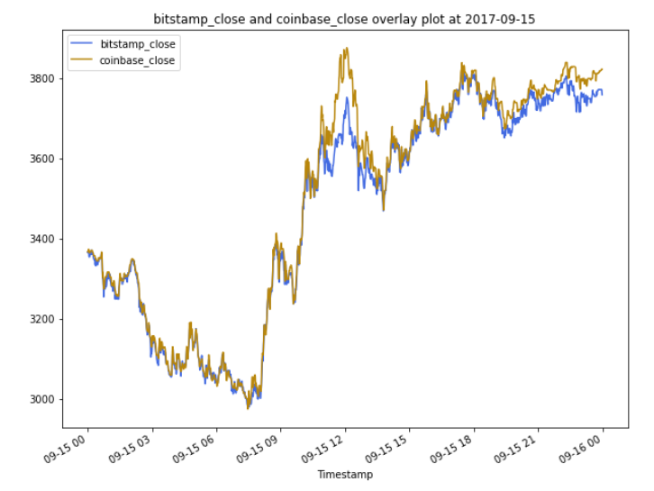

# Crypto Arbitrage

You'll take on the role of an analyst at a high-tech investment firm. The vice president (VP) of your department is considering arbitrage opportunities in Bitcoin and other cryptocurrencies. As Bitcoin trades on markets across the globe, can you capitalize on simultaneous price dislocations in those markets by using the powers of Pandas?

You’ll sort through historical trade data for Bitcoin on two exchanges: Bitstamp and Coinbase. Your task is to apply the three phases of financial analysis to determine if any arbitrage opportunities exist for Bitcoin.

This aspect of the work will consist of 3 phases.

1. Collect the data.
2. Prepare the data.
3. Analyze the data. 

 The application works by that taking in bitstamp.csv and coinbase.csv.



---

## Technologies

This project leverages python 3.7 with the following packages:

* [Pandas](https://pandas.pydata.org/) - Pandas is a Python library that’s designed speci cally for data analysis. It offers a streamlined way of reviewing datasets and includes
various functions that simplify importing, updating, and analyzing data.

* [JupyterLab](https://jupyter.org/) - JupyterLab is a web-based user interface that you use to run and review Python-based programs. It easily integrates with the Anaconda
software package and your Conda development environment.
---

## Installation Guide
Before running the application first install the following dependencies.
```python
sourse activate 
conda activate dev
conda list pandas
conda list jupyterlab
conda deactivate
conda remove --name dev --all
conda info --envs
conda update conda
conda create -n dev python=3.7 anaconda
python -m pip install pandas
pip install jupyter 
#check if pandas is installed successfully
conda list pandas
#check if jupyterlab is listed successfully
conda list jupyterlab
```
---
## Usage

To use the Crypto Arbitrage application simply clone the repository, downlaod bitstamp.csv,  coinbase.csv, and run the **crypto_arbitrage.ipynb** with:

```python
jupyter lab
```

---
## Contributors


---

## License
